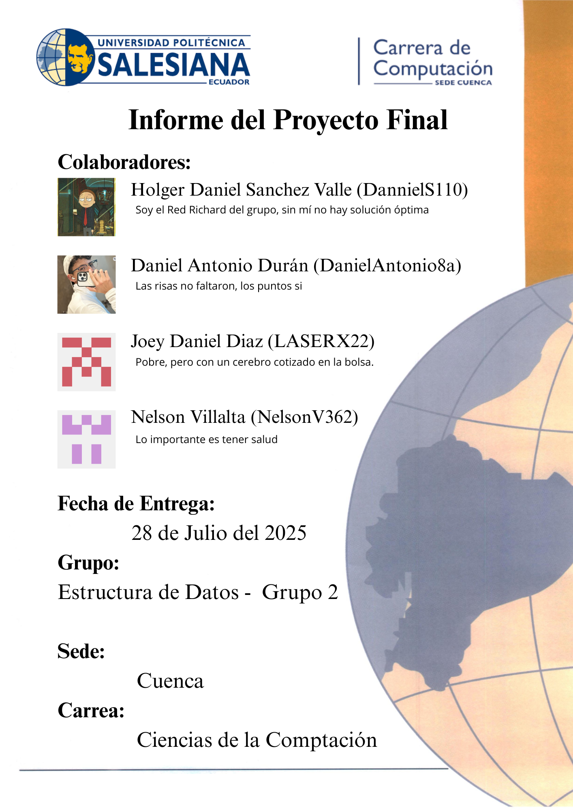
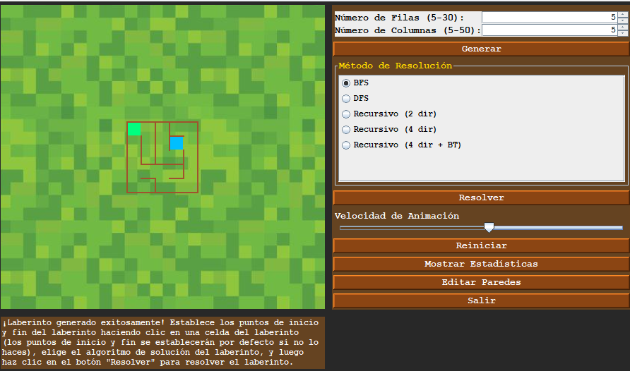
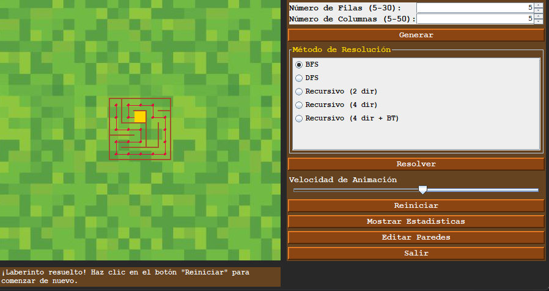
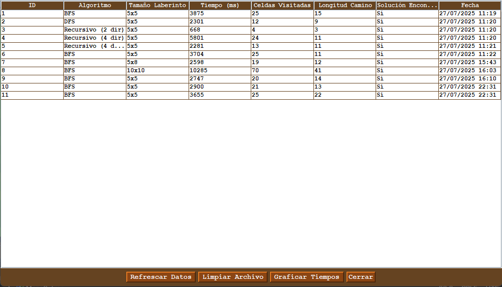
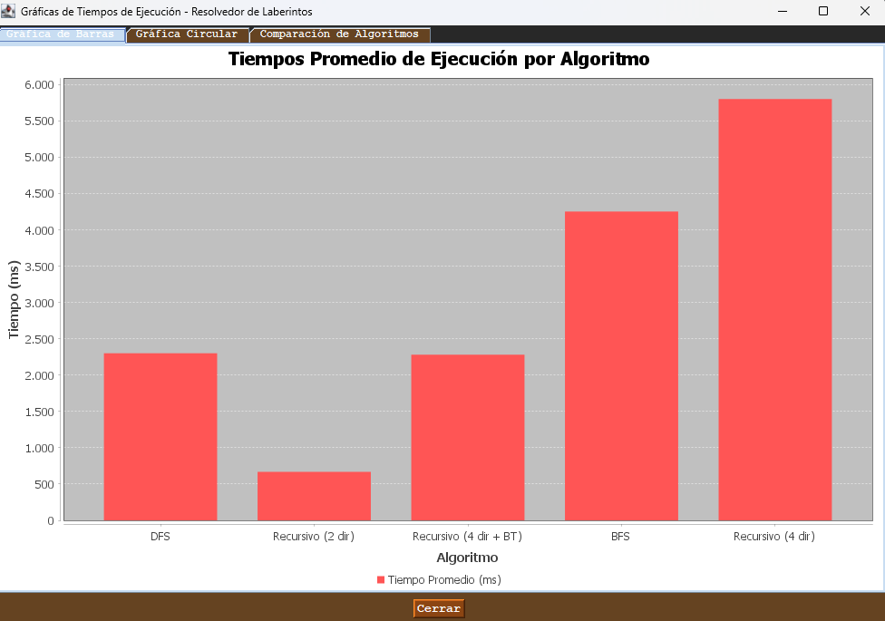
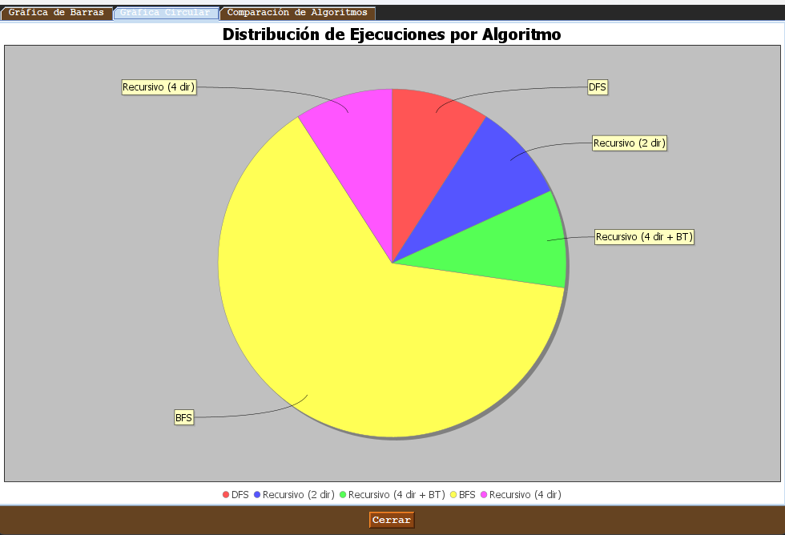
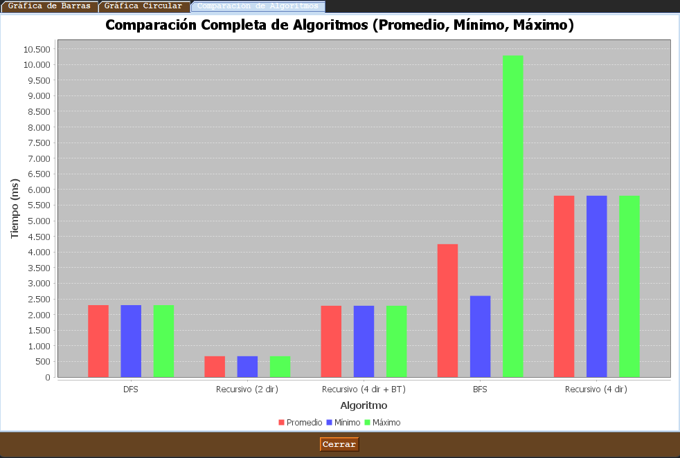

---
# Resolvedor de Laberintos - Proyecto Final

## 🎮 Descripción del problema.
El proyecto consiste en implementar diferentes algoritmos para encontrar la ruta óptima 
en un laberinto desde un punto inicial (A) hasta un destino (B), utilizando estructuras 
de datos avanzadas, programación dinámica y patrones de diseño como el MVC. 
El laberinto se representa mediante una matriz donde cada celda puede ser transitable o no.

## Propuesta de Solución

### Marco Teórico
- **DFS (Depth-First Search):** búsqueda en profundidad.
- **BFS (Breadth-First Search):** búsqueda en amplitud.
- **Backtracking:** técnica recursiva para explorar rutas alternativas y retroceder al encontrar caminos sin salida.
- **Programación Dinámica:** incluye técnicas como memoización y tabulación para optimizar búsquedas repetitivas.

### Tecnologías Utilizadas
- Lenguaje: Java
- Interfaz Gráfica: Swing
- Patrón de diseño: MVC (Modelo-Vista-Controlador)
- Almacenamiento de datos: CSV para tiempos de ejecución

### Diagrama UML
[Inserta aquí tu Diagrama UML explicando las clases DAO y Maze]

### Clases DAO
Las clases DAO (Data Access Object) gestionan la interacción entre la lógica del negocio y la persistencia de datos. En este proyecto, las clases DAO manejan el almacenamiento y recuperación del laberinto, tiempos de ejecución y resultados obtenidos:

- **MazeDao.java**: Gestiona operaciones de almacenamiento y carga del laberinto.
- **ResultsDao.java**: Registra tiempos y resultados de cada algoritmo ejecutado en archivos CSV.

Estas clases proporcionan métodos independientes para operaciones CRUD sobre los datos, desacoplando la lógica del programa de las operaciones directas sobre los archivos.

### Clases Maze
Las clases Maze representan la lógica central del laberinto:

- **Maze.java**: Representa la estructura del laberinto.
- **MazeSolver.java**: Clase abstracta que define métodos comunes para los diferentes algoritmos.
- **DFSMazeSolver.java**: Implementación del algoritmo DFS.
- **BFSMazeSolver.java**: Implementación del algoritmo BFS.
- **BacktrackingMazeSolver.java**: Implementación del algoritmo Backtracking.

### Interfaz
Se implementó una interfaz gráfica simple utilizando Swing, permitiendo al usuario:
- Configurar dinámicamente el tamaño del laberinto.
- Definir celdas transitables o bloqueadas.
- Seleccionar los puntos inicial y final.
- Visualizar gráficamente la ruta óptima encontrada.

### Ejemplo de Funcionamiento

---

---

---

---

---

---


### Código Ejemplo
```java
// Ejemplo de método BFS
public List<Point> bfsSolver(Point start, Point end, boolean[][] maze) {
    Queue<Point> queue = new LinkedList<>();
    queue.add(start);
    boolean[][] visited = new boolean[maze.length][maze[0].length];
    Map<Point, Point> path = new HashMap<>();

    while (!queue.isEmpty()) {
        Point current = queue.poll();
        if (current.equals(end)) {
            return reconstructPath(path, start, end);
        }

        for (Point neighbor : getNeighbors(current, maze)) {
            if (!visited[neighbor.x][neighbor.y]) {
                queue.add(neighbor);
                visited[neighbor.x][neighbor.y] = true;
                path.put(neighbor, current);
            }
        }
    }
    return Collections.emptyList();
}
```

---
## 🚀 Ejecutar la Aplicación

### Opción 1: JAR Ejecutable (Recomendado)
```bash
java -jar MazeSolver.jar
```

### Opción 2: Desde el código fuente
```bash
javac -cp "src;lib/*" src/MazeSolver.java
java -cp "src;lib/*" MazeSolver
```

## 📁 Estructura del Proyecto

```
Maze-Solver/
├── src/
│   ├── controller/          # Controladores MVC
│   ├── model/              # Modelos y algoritmos
│   ├── view/               # Interfaces gráficas
│   ├── dao/                # Acceso a datos
│   └── images/             # Recursos gráficos
├── lib/                    # Bibliotecas externas
├── MazeSolver.jar          # JAR ejecutable
├── build.ps1               # Script de compilación (PowerShell)
├── build.bat               # Script de compilación (Batch)
└── MANIFEST.MF             # Configuración del JAR
```

## 🎯 Características

### Algoritmos Implementados
- **BFS (Breadth-First Search)**
- **DFS (Depth-First Search)**
- **Recursivo (2 direcciones)**
- **Recursivo (4 direcciones)**
- **Recursivo (4 direcciones + Backtracking)**

### Funcionalidades
- ✅ Generación automática de laberintos
- ✅ Edición manual de paredes
- ✅ Visualización en tiempo real
- ✅ Estadísticas de rendimiento
- ✅ Persistencia de resultados
- ✅ Gráficos de comparación
- ✅ Tema visual Minecraft
- ✅ Splash screen y panel intermedio

## 🎨 Interfaz Visual

### Flujo de Navegación
1. **SplashScreen** - Pantalla de carga (5 segundos)
2. **IntermediatePanel** - Panel con imagen de integrantes
3. **MazeView** - Aplicación principal

### Temática Minecraft
- Colores de bloques de Minecraft
- Fuente monospaciada
- Estilo visual consistente
- Imágenes de fondo temáticas

## 📊 Estadísticas y Resultados

### Persistencia de Datos
- Archivo CSV: `algorithm_results.csv`
- Cada ejecución es un registro separado
- Métricas: tiempo, celdas visitadas, longitud del camino

### Visualización
- Tabla de resultados históricos
- Gráficos de barras y pastel
- Comparación entre algoritmos

## 🛠️ Requisitos del Sistema

- **Java 8 o superior**
- **Memoria RAM:** Mínimo 512MB
- **Sistema Operativo:** Windows, macOS, Linux

## 📦 Crear JAR Ejecutable

### Usando PowerShell
```powershell
.\build.ps1
```

### Usando Batch (Windows)
```cmd
build.bat
```

### Manualmente
```bash
# Compilar
javac -d build -cp "src;lib/*" src/**/*.java

# Crear JAR
jar cfm MazeSolver.jar MANIFEST.MF -C build .
```

## 🎮 Cómo Usar

1. **Ejecutar la aplicación**
2. **Generar laberinto** - Hacer clic en "Generar"
3. **Establecer puntos** - Hacer clic para marcar inicio y fin
4. **Seleccionar algoritmo** - Elegir método de resolución
5. **Resolver** - Hacer clic en "Resolver"
6. **Ver estadísticas** - Hacer clic en "Mostrar Estadísticas"
7. **Editar paredes** - Hacer clic en "Editar Paredes"

## 📈 Algoritmos y Rendimiento

### BFS (Breadth-First Search)
- **Ventaja:** Encuentra el camino más corto
- **Desventaja:** Puede visitar muchas celdas

### DFS (Depth-First Search)
- **Ventaja:** Rápido en laberintos simples
- **Desventaja:** No garantiza el camino más corto

### Recursivo (2 direcciones)
- **Ventaja:** Simple y eficiente
- **Desventaja:** Limitado a 2 direcciones

### Recursivo (4 direcciones)
- **Ventaja:** Más flexible
- **Desventaja:** Puede ser más lento

### Recursivo (4 direcciones + Backtracking)
- **Ventaja:** Mejor rendimiento
- **Desventaja:** Más complejo

## 🎯 Proyecto Final


---

*¡Disfruta resolviendo laberintos con estilo Minecraft!* 🎮 